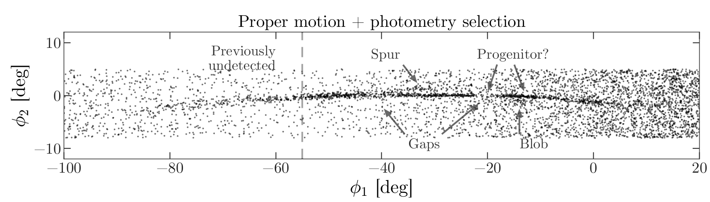
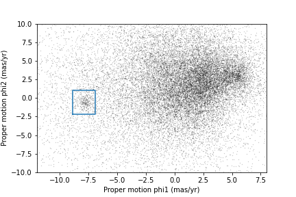

::::::::::::::::::::::::::::::::::::::: objectives

- Use a Boolean Pandas `Series` to select rows in a `DataFrame`.
- Save multiple `DataFrame`s in an HDF5 file.

::::::::::::::::::::::::::::::::::::::::::::::::::

:::::::::::::::::::::::::::::::::::::::: questions

- How do efficiently explore our data and identify appropriate filters to produce a clean sample (in this case of GD-1 stars)?

::::::::::::::::::::::::::::::::::::::::::::::::::


In the previous episode, we wrote a query to select stars from the
region of the sky where we expect GD-1 to be, and saved the results in
a FITS and HDF5 file.

Now we will read that data back in and implement the next step in the
analysis, identifying stars with the proper motion we expect for GD-1.

:::::::::::::::::::::::::::::::::::::::  checklist

## Outline

1. We will put those results into a Pandas `DataFrame`, which we will use
  to select stars near the centerline of GD-1.

2. Plotting the proper motion of those stars, we will identify a region
  of proper motion for stars that are likely to be in GD-1.

3. Finally, we will select and plot the stars whose proper motion is in
  that region.
  

::::::::::::::::::::::::::::::::::::::::::::::::::

::::::::::::::::::::::::::::::::::::::::::  prereq

## Starting from this episode

If you are starting a new notebook for this episode, expand this section
for information you will need to get started.

:::::::::::::::  spoiler

## Read me

Previously, we ran a query on the Gaia server, downloaded data for roughly 140,000
stars, transformed the coordinates to the GD-1 reference frame,
and saved the results in an HDF5 file (Dataset name `results_df`).
We will use that data for this episode.
Whether you are working from a new notebook or coming back from a checkpoint,
reloading the data will save you from having to run the query again.

If you are starting this episode here or starting this episode in a new notebook,
you will need to run the following lines of code.

This imports previously imported functions:

```python
import astropy.units as u
import matplotlib.pyplot as plt
import pandas as pd

from episode_functions import *
```

The following code loads in the data (instructions for downloading data can be
found in the [setup instructions](../learners/setup.md)). You may need to add a the path
to the filename variable below (e.g. `filename = 'student_download/backup-data/gd1_data.hdf'`)

```python
filename = 'gd1_data.hdf'
results_df = pd.read_hdf(filename, 'results_df')
```

:::::::::::::::::::::::::

::::::::::::::::::::::::::::::::::::::::::::::::::

## Exploring data

One benefit of using Pandas is that it provides functions for
exploring the data and checking for problems.
One of the most useful of these functions is `describe`, which
computes summary statistics for each column.

```python
results_df.describe()
```

```output
          source_id             ra            dec           pmra  \
count  1.403390e+05  140339.000000  140339.000000  140339.000000   
mean   6.792399e+17     143.823122      26.780285      -2.484404   
std    3.792177e+16       3.697850       3.052592       5.913939   
min    6.214900e+17     135.425699      19.286617    -106.755260   
25%    6.443517e+17     140.967966      24.592490      -5.038789   
50%    6.888060e+17     143.734409      26.746261      -1.834943   
75%    6.976579e+17     146.607350      28.990500       0.452893   
max    7.974418e+17     152.777393      34.285481     104.319923   

               pmdec       parallax           phi1           phi2  \
[Output truncated]
```

:::::::::::::::::::::::::::::::::::::::  challenge

## Exercise (10 minutes)

Review the summary statistics in this table.

- Do the values make sense based on what you know about the context?

- Do you see any values that seem problematic, or evidence of other data issues?

:::::::::::::::  solution

## Solution

The most noticeable issue is that some of the
parallax values are negative, which seems non-physical.

Negative parallaxes in the Gaia database can arise from a number of
causes like source confusion (high negative values) and the parallax
zero point with systematic errors (low negative values).

Fortunately, we do not use the parallax measurements in
the analysis (one of the reasons we used constant distance
for reflex correction).


:::::::::::::::::::::::::

::::::::::::::::::::::::::::::::::::::::::::::::::

## Plot proper motion

Now we are ready to replicate one of the panels in Figure 1 of the
Price-Whelan and Bonaca paper, the one that shows components of proper
motion as a scatter plot:


In this figure, the shaded area identifies stars that are likely to be
in GD-1 because:

- Due to the nature of tidal streams, we expect the proper motion for
  stars in GD-1 to be along the axis of the stream; that is, we expect
  motion in the direction of `phi2` to be near 0.

- In the direction of `phi1`, we do not have a prior expectation for
  proper motion, except that it should form a cluster at a non-zero
  value.

By plotting proper motion in the GD-1 frame, we hope to find this cluster.
Then we will use the bounds of the cluster to select stars that are
more likely to be in GD-1.

The following figure is a scatter plot of proper motion, in the GD-1
frame, for the stars in `results_df`.

```python
x = results_df['pm_phi1']
y = results_df['pm_phi2']
plt.plot(x, y, 'ko', markersize=0.1, alpha=0.1)
    
plt.xlabel('Proper motion phi1 (mas/yr GD1 frame)')
plt.ylabel('Proper motion phi2 (mas/yr GD1 frame)')
```

```output
<Figure size 432x288 with 1 Axes>
```

{alt='Scatter plot of proper motion in GD-1 frame of selected stars showing most are near the origin.'}

Most of the proper motions are near the origin, but there are a few
extreme values.
Following the example in the paper, we will use `xlim` and `ylim` to
zoom in on the region near the origin.

```python
x = results_df['pm_phi1']
y = results_df['pm_phi2']
plt.plot(x, y, 'ko', markersize=0.1, alpha=0.1)
    
plt.xlabel('Proper motion phi1 (mas/yr GD1 frame)')
plt.ylabel('Proper motion phi2 (mas/yr GD1 frame)')

plt.xlim(-12, 8)
plt.ylim(-10, 10)
```

```output
<Figure size 432x288 with 1 Axes>
```

{alt='Zoomed in view of previous scatter plot showing overdense region.'}

There is a hint of an overdense region near (-7.5, 0), but if you
did not know where to look, you would miss it.

To see the cluster more clearly, we need a sample that contains a
higher proportion of stars in GD-1.
We will do that by selecting stars close to the centerline.

## Selecting the centerline

As we can see in the following figure, many stars in GD-1 are less
than 1 degree from the line `phi2=0`.

{alt='Scatter plot with selection on proper motion and photometry showing many stars in GD-1 are within 1 degree of phi2 = 0.'}

Stars near this line have the highest probability of being in GD-1.

To select them, we will use a "Boolean mask".  We will start by
selecting the `phi2` column from the `DataFrame`:

```python
phi2 = results_df['phi2']
type(phi2)
```

```output
pandas.core.series.Series
```

The result is a `Series`, which is the structure Pandas uses to
represent columns.

We can use a comparison operator, `>`, to compare the values in a
`Series` to a constant.

```python
phi2_min = -1.0 * u.degree
phi2_max = 1.0 * u.degree

mask = (phi2 > phi2_min)
type(mask)
```

```output
pandas.core.series.Series
```

The result is a `Series` of Boolean values, that is, `True` and `False`.

```python
mask.head()
```

```output
0    False
1    False
2    False
3    False
4    False
Name: phi2, dtype: bool
```

To select values that fall between `phi2_min` and `phi2_max`, we will
use the `&` operator, which computes "logical AND".
The result is true where elements from both Boolean `Series` are true.

```python
mask = (phi2 > phi2_min) & (phi2 < phi2_max)
```

:::::::::::::::::::::::::::::::::::::::::  callout

## Logical operators

Python's logical operators (`and`, `or`, and `not`)
do not work with NumPy or Pandas.  Both libraries use the bitwise
operators (`&`, `|`, and `~`) to do elementwise logical operations
([explanation here](https://stackoverflow.com/questions/21415661/logical-operators-for-boolean-indexing-in-pandas)).

Also, we need the parentheses around the conditions; otherwise the
order of operations is incorrect.


::::::::::::::::::::::::::::::::::::::::::::::::::

The sum of a Boolean `Series` is the number of `True` values, so we
can use `sum` to see how many stars are in the selected region.

```python
mask.sum()
```

```output
25084
```

A Boolean `Series` is sometimes called a "mask" because we can use it
to mask out some of the rows in a `DataFrame` and select the rest,
like this:

```python
centerline_df = results_df[mask]
type(centerline_df)
```

```output
pandas.core.frame.DataFrame
```

`centerline_df` is a `DataFrame` that contains only the rows from
`results_df` that correspond to `True` values in `mask`.
So it contains the stars near the centerline of GD-1.

We can use `len` to see how many rows are in `centerline_df`:

```python
len(centerline_df)
```

```output
25084
```

And what fraction of the rows we have selected.

```python
len(centerline_df) / len(results_df)
```

```output
0.1787386257562046
```

There are about 25,000 stars in this region, about 18% of the total.

## Plotting proper motion

This is the second time we are plotting proper motion, and we can imagine we might do it a few more times. Instead of copying
and pasting the previous code, we will write a function that we can reuse on any dataframe.

```python
def plot_proper_motion(df):
    """Plot proper motion.
    
    df: DataFrame with `pm_phi1` and `pm_phi2`
    """
    x = df['pm_phi1']
    y = df['pm_phi2']
    plt.plot(x, y, 'ko', markersize=0.3, alpha=0.3)

    plt.xlabel('Proper motion phi1 (mas/yr)')
    plt.ylabel('Proper motion phi2 (mas/yr)')

    plt.xlim(-12, 8)
    plt.ylim(-10, 10)
```

And we can call it like this:

```python
plot_proper_motion(centerline_df)
```

```output
<Figure size 432x288 with 1 Axes>
```

{alt='Scatter plot of proper motion of selected stars showing cluster near (-7.5, 0).'}

Now we can see more clearly that there is a cluster near (-7.5, 0).

You might notice that our figure is less dense than the one in the
paper.  That is because we started with a set of stars from a
relatively small region.  The figure in the paper is based on a region
about 10 times bigger.

In the next episode we will go back and select stars from a larger
region.  But first we will use the proper motion data to identify stars
likely to be in GD-1.

## Filtering based on proper motion

The next step is to select stars in the "overdense" region of proper
motion, which are candidates to be in GD-1.

In the original paper, Price-Whelan and Bonaca used a polygon to cover
this region, as shown in this figure.


We will use a simple rectangle for now, but in a later lesson we will see
how to select a polygonal region as well.

Here are bounds on proper motion we chose by eye:

```python
pm1_min = -8.9
pm1_max = -6.9
pm2_min = -2.2
pm2_max =  1.0
```

To draw these bounds, we will use the `make_rectangle` function we wrote in episode 2 to make two lists containing the coordinates of the corners of the rectangle.

```python
pm1_rect, pm2_rect = make_rectangle(
    pm1_min, pm1_max, pm2_min, pm2_max)
```

Here is what the plot looks like with the bounds we chose.

```python
plot_proper_motion(centerline_df)
plt.plot(pm1_rect, pm2_rect, '-')
```

```output
<Figure size 432x288 with 1 Axes>
```

{alt='Scatter plot of proper motion with blue box showing overdense region selected for our analysis.'}

Now that we have identified the bounds of the cluster in proper motion,
we will use it to select rows from `results_df`.

We will use the following function, which uses Pandas operators to make
a mask that selects rows where `series` falls between `low` and
`high`.

```python
def between(series, low, high):
    """Check whether values are between `low` and `high`."""
    return (series > low) & (series < high)
```

The following mask selects stars with proper motion in the region we chose.

```python
pm1 = results_df['pm_phi1']
pm2 = results_df['pm_phi2']

pm_mask = (between(pm1, pm1_min, pm1_max) & 
           between(pm2, pm2_min, pm2_max))
```

Again, the sum of a Boolean series is the number of `TRUE` values.

```python
pm_mask.sum()
```

```output
1049
```

Now we can use this mask to select rows from `results_df`.

```python
selected_df = results_df[pm_mask]
len(selected_df)
```

```output
1049
```

These are the stars we think are likely to be in GD-1.  We can
inspect these stars, plotting their coordinates (not their proper motion).

```python
x = selected_df['phi1']
y = selected_df['phi2']
plt.plot(x, y, 'ko', markersize=1, alpha=1)

plt.xlabel('phi1 (degree GD1)')
plt.ylabel('phi2 (degree GD1)')
```

```output
<Figure size 432x288 with 1 Axes>
```

{alt='Scatter plot of coordinates of stars in selected region, showing tidal stream.'}

Now that is starting to look like a tidal stream!

To clean up the plot a little bit we can add two new Matplotlib commands:

- `axis` with the parameter `equal` sets up the axes so a unit is the
  same size along the `x` and `y` axes.

- `title` puts the input string as a title at the top of the plot. The `fontsize` keyword
  sets the `fontsize` to be `medium`, a little smaller than the default `large`.

In an example like this, where `x` and `y` represent coordinates in
space, equal axes ensures that the distance between points is
represented accurately. Since we are now constraining the relative proportions
of our axes, the data may not fill the entire figure.

```python
x = selected_df['phi1']
y = selected_df['phi2']

plt.plot(x, y, 'ko', markersize=0.3, alpha=0.3)

plt.xlabel('phi1 [deg]')
plt.ylabel('phi2 [deg]')
plt.title('Proper motion selection', fontsize='medium')

plt.axis('equal')
```

```output
<Figure size 432x288 with 1 Axes>
```

{alt='Scatter plot of coordinates of stars in selected region, showing tidal stream with equally proportioned axes.'}

Before we go any further, we will put the code we wrote to make one of the panel
figures into a function that we will use in future episodes to recreate this
entire plot with a single line of code.

```python
def plot_pm_selection(df):
    """Plot in GD-1 spatial coordinates the location of the stars
    selected by proper motion
    """
    x = df['phi1']
    y = df['phi2']

    plt.plot(x, y, 'ko', markersize=0.3, alpha=0.3)

    plt.xlabel('phi1 [deg]')
    plt.ylabel('phi2 [deg]')
    plt.title('Proper motion selection', fontsize='medium')

    plt.axis('equal')
```

Now our one line plot command is:

```python
plot_pm_selection(selected_df)
```

## Saving the DataFrame

At this point we have run a successful query and cleaned up the
results. This is a good time to save the data.
We have already started a results file called gd1\_data.hdf which we wrote `results_df` to.

Recall that we chose HDF5 because it is a binary format producing small files that are fast to read and write and are a cross-language standard.

Additionally, HDF5 files can contain more than one dataset and can store metadata associated with each dataset (such as column names or observatory information, like a FITS header).

We can add to our existing Pandas `DataFrame` to an HDF5 file by omitting the `mode='w'` keyword like this:

```python
filename = 'gd1_data.hdf'

selected_df.to_hdf(filename, 'selected_df')
```

Because an HDF5 file can contain more than one Dataset, we have to
provide a name, or "key", that identifies the Dataset in the file.

We could use any string as the key, but it is generally a good practice
to use a descriptive name (just like your `DataFrame` variable name) so
we will give the Dataset in the file the same name (key) as the `DataFrame`.

:::::::::::::::::::::::::::::::::::::::  challenge

## Exercise (5 minutes)

We are going to need `centerline_df` later as well.  Write a line of
code to add it as a second Dataset in the HDF5 file.

Hint: Since the file already exists, you should *not* use `mode='w'`.

:::::::::::::::  solution

## Solution

```python
centerline_df.to_hdf(filename, 'centerline_df')
```

:::::::::::::::::::::::::

::::::::::::::::::::::::::::::::::::::::::::::::::

We can use `getsize` to confirm that the file exists and check the size.
`getsize` returns a value in bytes. For the size files we're looking at, it will
be useful to view their size in MegaBytes (MB), so we will divide by 1024\*1024.

```python
from os.path import getsize

MB = 1024 * 1024
getsize(filename) / MB
```

```output
13.992530822753906
```

If you forget what the names of the Datasets in the file are, you can
read them back like this:

```python
with pd.HDFStore(filename) as hdf:
    print(hdf.keys())
```

```output
['/centerline_df', '/results_df', '/selected_df']
```

:::::::::::::::::::::::::::::::::::::::::  callout

## Context Managers

We use a `with` statement here to open the file
before the print statement and (automatically) close it after.  Read
more about [context managers](https://book.pythontips.com/en/latest/context_managers.html).


::::::::::::::::::::::::::::::::::::::::::::::::::

The keys are the names of the Datasets which makes it easy for us to remember which `DataFrame` is
in which Dataset.

## Summary

In this episode, we re-loaded the transformed Gaia data we saved from a previous query.

Then we prototyped the selection process from the Price-Whelan and Bonaca paper locally using data that we had already downloaded.:

- We selected stars near the centerline of GD-1 and made a scatter
  plot of their proper motion.

- We identified a region of proper motion that contains stars likely
  to be in GD-1.

- We used a Boolean `Series` as a mask to select stars whose proper
  motion is in that region.

So far, we have used data from a relatively small region of the sky so that our local dataset was not too big.
In the next lesson, we will write a query that selects stars based on
the proper motion limits we identified in this lesson, which will allow us to explore a larger region.

:::::::::::::::::::::::::::::::::::::::: keypoints

- A workflow is often prototyped on a small set of data which can be explored more easily and used to identify ways to limit a dataset to exactly the data you want.
- To store data from a Pandas `DataFrame`, a good option is an HDF5 file, which can contain multiple Datasets.

::::::::::::::::::::::::::::::::::::::::::::::::::


